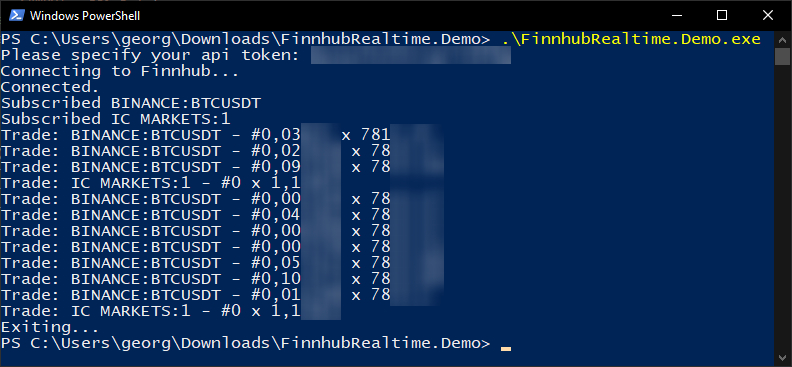

<p style="text-align: center;">
  <a href="https://www.nuget.org/packages/FinnhubRealtime/">
    
  </a>
</p>

# FinnhubRealtime
[](https://www.nuget.org/packages/FinnhubRealtime/)
[](https://dev.azure.com/georg-jung/FinnhubRealtime/_build/latest?definitionId=8&branchName=master)

FinnhubRealtime is a .Net Standard 2.1 client library for receiving [Finnhub.io](https://finnhub.io) [real-time price updates](https://finnhub.io/docs/api#websocket-price) via the websocket interface. A small demo application can be found in this repository.



## Usage

```csharp
cl = new WebsocketClient("YOUR API TOKEN");
await cl.Connect();
await cl.Subscribe("AAPL");
while (true)
{
    var msg = await cl.Receive();
    if (msg is TradeMessage trade) {
        var tradeStr = string.Join("\n", trade.Data.Select(t => $"{t.S} - #{t.V} x {t.P}"));
        Console.WriteLine(tradeStr);
    }
}
```
